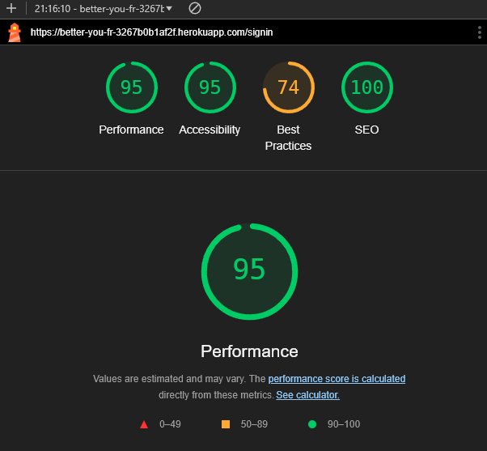
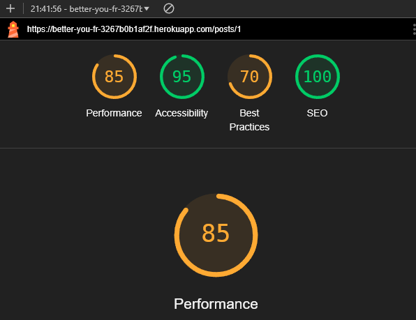

# [Better You](https://better-you-ec0aa381f182.herokuapp.com/)

[](https://github.com/conor-timmis/Better-You/commits/main)
[](https://github.com/conor-timmis/Better-You/commits/main)
[](https://github.com/conor-timmis/Better-You)

This repository contains the frontend code for the Better You website. The backend Django Rest Framework API repository can be found [here](https://github.com/conor-timmis/Better-You-API). The frontend is built using React, React-Bootstrap, JavaScript, JSX, and is hosted on Heroku.

Welcome to Better You, the social platform dedicated to anybody looking to further themselves in the self-improvement space. This is a varied topic but aimed towards you and like-minded others who would like to better themselves, take on life from a whole new perspective, and gain experiences in ways they never thought possible. Better You, as a site, is a social media website, but heavily focused on self-improvement. As much as it is a broad subject, it has been simplified to stay within the relevant categories of the topic. I have built this as someone who has gone through something very similar over the last few years and experienced major changes in my life to get to this point. As a brief summary, I used to be the person who thought going outside was boring, and gaming was everything. But these days, it's the total opposite. It was definitely not an easy challenge to overcome, but I gained all kinds of new confidence and experienced many things, whether at work, at home, or outside in my free time. I cannot recommend enough that anyone take a similar path, even if the circumstances are not exactly the same, and see what is out there for yourself!


## Table of Contents

1. [Purpose](#1-purpose)
2. [Features](#2-features)
3. [Requirement Gathering and Planning](#3-requirement-gathering-and-planning)
    - [Brief Competitor Analysis and Target Demographic](#brief-competitor-analysis-and-target-demographic)
    - [User Journeys](#user-journeys)
    - [User Permissions](#user-permissions)
    - [React Components](#react-components)
    - [API Integration](#api-integration)
    - [Data Validation](#data-validation)
    - [Error Messaging](#error-messaging)
4. [User Interface Design](#4-user-interface-design)
    - [Wireframes](#wireframes)
    - [Colour Scheme](#colour-scheme)
    - [Icons](#icons)
5. [Testing](#5-testing)
    - [Continuous Testing](#continuous-testing)
    - [Manual Testing](#manual-testing)
    - [Functional Testing](#functional-testing)
    - [Browser Compatibility and Screen Size Responsiveness](#browser-compatibility-and-screen-size-responsiveness)
    - [Code Validation](#code-validation)
    - [Accessibility](#accessibility)
6. [Bugs](#6-bugs)
7. [Set Up and Deployment](#7-set-up-and-deployment)
    - [Libraries](#libraries)
    - [React Set Up](#running-locally)
    - [Deployment](#deployment)
8. [Agile Methodology](#8-agile-methodology)
    - [Epics and User Stories](#epics-and-user-stories)
9. [Future Development](#9-future-development)
10. [Credits](#10-credits)

## 1. Purpose

The goal of Better You is to create a dedicated platform for individuals focused on self-improvement. It provides a space for users to share experiences, gain new perspectives, and connect with like-minded people, all while simplifying the broad topic of personal development into easily navigable categories.

Here’s a revised and more polished version of your "Features" section:

---

## 2. Features

### Existing Features

-   **Navigation Bar**: Located at the top of every page, the navigation bar provides seamless access to all parts of the site. It is fully responsive, adapting its content based on whether the user is signed in or not.

    - **Signed Out View**

    

    - **Signed In View**

    

-   **Home View**: This page is a brief overview of what you can experience without having access to everything, but with understanding of what is going on throughout the site.

    

-   **Registration Page**: A clean, minimal page featuring a simple form for users to become members of Better You.

    

-   **Feed Page**: This page conveniently displays posts from all the users you follow in one place, creating a personalized viewing experience.

    

-   **Liked Page**: Users can browse all of their previously liked posts they have made, making it easier to find posts they enjoy at another time.

    


-   **My Profile**: This serves as your personal portfolio. Your profile page will be the display for your posts, followers and following count. It will also display your personal posts in a feed so you can take a look at everything you have posted.

    


-   **Profile Editing**: Users can easily update their profile information from the Profile page, allowing you to customise your profile picture, bio, username and password at any time.

    
    

-   **Posting**: Users can create posts on the site and post within relevence to the tag they have chosen, this could be an accomplishment post, one to strike inspiration or even just a learning experience from what happened that day for them. 

    

-   **Comments/Rating/Liking**: Users can comment on a post created by another user, like their post if they found the content to be enjoyable and even leave a rating on the post to show appreciation for what the user has posted.

    

## 3. Requirement Gathering and Planning

### Brief Competitor Analysis and Target Demographic

When analysing competitors in the realm of online portfolio platforms for Self Improvement, several notable options come to mind:

-   Instagram is widely used by influencers and individuals in the self-improvement niche to share motivational content, personal growth stories, and wellness tips. However, its broad focus on various content types makes it less specialized for dedicated personal development journeys and lacks built-in tools to track progress or growth.
-   Coach.me is a platform that combines personal goal-setting with community support. It offers coaching services and goal tracking to help users develop new habits. However, its interaction is more focused on coaching and less on community-building for like-minded individuals to share their journeys.
-   Mindvalley provides personal growth courses, workshops, and events, focusing on holistic self-improvement across various domains like health, spirituality, and career. Though highly specialized in content, it is primarily a learning platform rather than a social space for user interaction and community building.

In this landscape, Better You aims to carve out a unique niche by offering a dedicated platform specifically for individuals focused on personal growth. It provides a community-driven environment where users can not only share their self-improvement journeys but also interact with like-minded individuals, gain inspiration, and offer support to one another. The goal is to foster a specialized community that encourages personal development, making Better You an ideal platform for those looking to enhance their lives in a targeted, supportive, and motivational setting.

### User Journeys

These are the core user journeys, it is not an exhaustive list of all possible user journeys, just the most important ones:

1. Sign Up and Edit User Details


2. Create a Post


3. Browse and Interact with Posts


4. Edit or Delete a Post


5. View Liked Posts


### User Permissions

Before signing up, users can explore the home page to learn more about Better You and view a sample of the content posted by users. They can also access the sign-up and login pages without needing an account.

Once signed in, users can access the full site, with restrictions ensuring they can only add, edit, or view their own personal details and posts.

The table below provides a detailed overview of page access based on authentication and authorisation:

Authentication: Requires the user to be logged in.
Authorisation: Limits access to a user's own content.
Neither: Accessible without being logged in.

| Page                                 | Access Logged Out? | Access Logged In? | Access Only Own? |
| ------------------------------------ | ------------------ | ----------------- | ---------------- |
| Home                                 | Yes                | Yes               | N/A              |
| Sign Up                              | Yes                | No                | N/A              |
| Login                                | Yes                | No                | N/A              |
| Feed                                 | No                 | Yes               | Yes              |
| Liked                                | No                 | Yes               | N/A              |
| Profile                              | No                 | Yes               | No               |
| Post Create                          | No                 | Yes               | Yes              |
| Post Edit                            | No                 | Yes               | Yes              |
| Contact                              | Yes                | Yes               | N/A              |

Admins can access the Django admin panel for the backend API.

### React Components

This project includes several reusable React components that are used across various parts of the application. They are documented below along with their purpose and main props: 

| **Component**          | **Purpose**                                                                 | 
|------------------------|-----------------------------------------------------------------------------|
| `AppHeader`            | The main header of the application, displaying the app's title, profile name, and navigation. |
| `NavBar`               | Main navigation bar with links to various app sections, including profile and login/logout.   |
| `Avatar`               | Displays every usersAvatars and how they operate/with style throughout the site.              |
| `NotFound`             | The component that shows whenever there is nothing to be found in the resource.               |
| `StarRating`           | The system in place to post and view other users ratings on comments as well as your own.     |
| `Comment`              | Comment component is how you view yours and other users comments throughout a post.           |
| `Post`                 | Post component is how you view yours and other users posts throughout the feed.               |
| `PopularProfiles`      | Displays the top 5 popular profiles (in terms of follower count) on the side of the feed.     |


### API Integration

The HTTP requests specifications have been defined in detail, in the backend API README, [here](https://github.com/conor-timmis/Better-You-API). These formats have been used.

**Authentication Mechanism**
JSON Web Tokens (JWTs) are used for token-based authentication.

**Cross-Origin Resourcer Sharing (CORS)**
CORS is configured on the Django backend to allow requests from this React frontend. This has been done using the `django-cors-headers` package which will handle those settings.

**Data Fetching and State Management**
Axios is used for making HTTP requests to the DJango REST API backend.

React Context and Hooks are used for simple state management.

### Data Validation

Comprehensive data format specifications are available in the API repository's README. This frontend ensures that only valid data is sent to the back end by performing field-level validation before submitting any requests.

### Error Messaging

The Django REST API back end will return relevant HTTP status codes, allowing the React front end to show clear error messages to users, which helps them identify and fix problems. However, since the front end is designed to avoid situations that could cause 400, 404, or other errors, only a limited number of error messages are needed. The API error codes are documented to assist with any direct API access or use by different front ends.                                                                                       |

## 4. User Interface Design


### Wireframes

The wireframes were created using Balsamiq and they illustrate the core user interface and functionality of Better You from a monitor and mobile device perspective. These visual guides serve as the blueprint for the structure and design of the application, ensuring a cohesive and intuitive user experience.

#### Home Page


#### Feed


#### Liked


#### My Profile

Default View:


Profile Edit View:


#### Sign Up


#### Home Page


### Colour Scheme

I aimed to choose a simple yet vibrant color scheme for the site to keep it visually appealing and easy to navigate. The goal is to avoid making the design feel "confusing" and ensure that the colors work well together, making navigation smooth and intuitive, I have chosen to display my colour scheme with a site called [Coolors](https://coolors.co/) as it is perfect for displaying all the prominent colours used throughout my project.


### Icon

I generated my Logo & Favicon through a site called [Logo](https://logo.com/) and I wanted a very basic and even somewhat corporate but also a meaningful icon that will be memorable to look at after using the site, as I feel like Logo and display/meaning has its own purpose for a site of this size.


## 5. Testing

### Continuous Testing

Using a combination of automated tests written with Jest and manual testing from the frontend, I achieved comprehensive test coverage. I also ran the code through validators and linters to ensure adherence to coding standards and best practices, aiming for robust and maintainable code.

### Manual Testing

My manual testing covered:

-   Each user journey from end to end - see [User Journeys section](#user-journeys).
-   The level of access when logged out
-   The level of access when logged in and whether the user could only access their own personal details and posts of functionality intended only for them

Below is a breakdown of the key areas: 

1. **User Registration and Authentication**

**Goal**: To verify that users can register, log in, and log out correctly.

**Steps**:
- Registered with valid credentials.
- Tried to register with invalid credentials (e.g., password mismatch).
- Logged in successfully with valid credentials.
- Tried logging in with incorrect credentials to ensure error messages appeared.
- Logged out and confirmed access to restricted pages was denied after logout.

**Edge Cases**:
- Tried to submit empty or incomplete forms, ensuring appropriate validation messages appeared.
- Attempted to access restricted pages without logging in and verified redirection to the login page.
- Tried to use a duplicate email for registration and ensured that the API prevented it with an appropriate error message.

2. **Profile Management**

**Goal**: To confirm that users can view and edit their profile correctly, including adding a profile image URL and updating personal details.

**Steps**:
- Logged in, navigated to "Profile", and edited profile details (username, biography, profile image URL).
- Ensured the updated profile details were reflected immediately on the UI.

**Edge Case**:
- Left profile fields empty to test form validation.

3. **Post Creation, Editing, and Deletion**

**Goal**: To test the full lifecycle of post management—creating, editing, and deleting a post.

**Steps**:
- Created a new post by filling out all required fields and submitting the form.
- Edited an existing post, updating the title, post and tag.
- Deleted a post and confirmed it no longer appeared on the "Profile" page.

**Edge Cases**:
- Left mandatory fields (title, image URL) empty to check if the form prevented submission.
- Checked that only the owner of a post could edit or delete it, ensuring permission boundaries were respected.

4. **Browsing and Interacting with Posts**

**Goal**: To ensure that users can browse, search, filter, and interact with posts (e.g., commenting, rating).

**Steps**:
- Used the search bar and filters on the Explore page to find specific posts.
- Commented on a post and verified that the comment appeared.
- Rated a post and ensured the rating updated correctly in the API.

**Edge Cases**:
- Tried submitting an empty comment and verified that the form did not allow it.
- Checked that users could not rate their own posts by confirming the rating UI was hidden for the post owner.

5. **Feed**

**Goal**: To confirm that users can view their personalised feed (who they follow, their posts).

**Steps**:
- Follow a new user who has not made any posts.
- Refresh the feed to confirm that the feed does not show any empty or placeholder content for the followed user’s posts.
- Confirm that the feed shows posts only from users with available posts and handles the absence of posts gracefully.

**Edge Case**:
- The feed does not display any placeholder or "missing" posts for users who haven’t posted yet, and it continues to display posts from other users normally. The UI should indicate the absence of posts from the newly followed user without errors.

This made up the bulk of the testing and was carried out continuously throughout the build, ensuring each change had the intended result.

### Functional Testing

Functional testing focused on ensuring that each component worked as intended and handled user interaction smoothly. This included testing functionality such as:

**Navigation**: Verified that all links, including internal navigation, worked correctly (e.g., clicking on a profile, going to the posts detail page).
**Search and Filtering**: Checked that search and filter inputs dynamically updated results and that the system performed as expected with both broad and narrow search terms.

### Browser Compatibility and Screen Size Responsiveness

I viewed the site on each of the three key screen sizes (mobile, tablet and computer), using devtools, on three of the most popular browsers. 

Pixel references for each of the screen sizes:

| Screen             | Pixels |
| ------------------ | ------ |
| Mobile - iPhone SE | 375px  |
| Tablet - iPad Mini | 768px  |
| Computer           | 1920px |

| Browser | Screen Size       | Appearance | Responsiveness |
| ------- | ----------------- | ---------- | -------------- |
| Chrome  | Mobile            | Good       |     Good       |
|         | Tablet            | Good       |     Good       |
|         | Computer          | Good       |     Good       |
| Firefox | Mobile            | Good       |     Good       |
|         | Tablet            | Good       |     Good       |
|         | Computer          | Good       |     Good       |
| Arc     | Mobile            | Good       |     Good       |
|         | Tablet            | Good       |     Good       |
|         | Computer          | Good       |     Good       |

**Goal**: To verify that the site is fully responsive across different screen sizes and that the UI adapts correctly on mobile devices.

**Steps**:
- Used dev tools to simulate mobile (iPhone SE), tablet (iPad Mini), and computer (1920px) views in Chrome, Firefox, and Safari.
- Ensured that components e.g. the navigation bar, post cards and comments page were usable and well-formatted on smaller screens.
- Ensured that each page looked as intended on all screen sizes.

### Code Validation

| Language   | Validation Method                                                             | Outcome |
| ---------- | ----------------------------------------------------------------------------- | ------- |
| HTML       | Via direct input on [W3C HTML Validator](https://validator.w3.org/)           |  No errors |
| CSS        | Via direct input on [W3C CSS Validator](https://jigsaw.w3.org/css-validator/) |  No errors |
| JavaScript | Via command line [ES Lint](https://eslint.org/)                               |  No errors |


### Accessibility

**Lighthouse**

To ensure the front end of my program was accessible I used Lighthouse and recorded the final results for each page below:

| Page | Result |
| ---- | ------ |
| Home |  |
| Login |  |
| Feed |  |
| Liked |  |
| Profile View |  |
| Post Detail |  |
| Create Post |  |

## 6. Bugs

Here is a list showing a selection of bugs found towards the end of development. This list is not exhaustive but is intended to give a sample of the types of things that were found and fixed. I don't believe I have left any unresolved bugs.

### Bug One

Issue: As I followed the lessons with Moments & DRF API, I had some major issues with setup and at one point, my API was still at a point where it could not communicate with my Frontend and vice versa. The result of this was when both were deployed, the front deployed site would simply not allow me to use the navbar as intended and assume every session was "logged in" but also unable to access any other pages. Though it did this, the Gitpod environment live version would work as intended.


Fix: Once the API was setup as intended, and with the Frontend allowed in CORS & ALLOWED_HOSTS the Frontend was able to be used as fully intended as well as the whole site.


## 7. Set Up and Deployment

### Libraries

Several front end libraries were utilised during this project. Below I set out which ones, their purpose and my reasoning for using them. 

| **Library**            | **Purpose**                                                                 | **Reasoning**                                                |
|------------------------|-----------------------------------------------------------------------------|---------------------------------------------------------------------|
| **React** | A JavaScript library for building user interfaces. | React's component-based structure makes it easy to manage the dynamic UI in this project by keeping the code modular, reusable, and efficient when it comes to rendering and managing state.|
| **React Router** | Enables routing and navigation in single-page applications. | Handles navigation and dynamic route management smoothly, making it easy to switch between pages like profiles, posts, and searches, while keeping the URL structure clean and organised. |
| **React Bootstrap**  | A UI framework that provides pre-built responsive components.  | Speeds up UI development with ready-made, responsive components like forms, buttons, and modals. This keeps the app's design consistent and cuts down on the need for writing custom CSS. |
| **Font Awesome** | A library of vector icons for use in the UI.  | Provides a wide range of customisable icons that enhance the visual appeal and user experience by providing clear, intuitive cues (like notification and profile icons), all without adding much overhead to the project. |
| **Axios**  | A promise-based HTTP client for making requests to APIs. | Simplifies making asynchronous HTTP requests to the backend, including handling authentication tokens and error management. |
| **Simple Star Rating**  | A rating system for React Apps. | Creates a visual view of Rating in the form of stars (typically 1-5) with the use of mouseover action. |


### Running Locally

-   Install Node and npm
-   Install the dependencies by running: `npm install`

### Deployment

The live deployed application can be found deployed on [Heroku](https://better-you-fr-3267b0b1af2f.herokuapp.com/).


### Heroku Deployment

This project uses [Heroku](https://www.heroku.com), a platform as a service (PaaS) that enables developers to build, run, and operate applications entirely in the cloud.

To deploy this React app on Heroku, follow these steps:

1. **Install Heroku CLI (Optional)**
    If you'd like to deploy directly from the command line, you can install the Heroku CLI on your local machine. Otherwise, you can deploy using a GitHub repository or another similar method.

2. **Prepare the Application**  
   - Ensure the application is production-ready by running:
     ```bash
     npm run build
     ```
     This generates an optimized production build in the `build/` directory.

3. **Deployment Files**  
   Ensure the following files are present in the repository for Heroku deployment:
   - `Procfile`  
     Contains:
     ```
     web: serve -s build
     ```
   - `package.json`  
     Includes the `heroku-postbuild` script to build the React app:
     ```json
     "scripts": {
       "start": "node server.js",
       "build": "react-scripts build",
       "heroku-postbuild": "npm run build"
     }
     ```

4. **Deploy to Heroku**  
   - Push the code to a new Heroku app by following these steps:
     1. Log in to Heroku:
        ```bash
        heroku login
        ```
     2. Create a new Heroku app:
        ```bash
        heroku create your-app-name
        ```
     3. Push the code:
        ```bash
        git push heroku main
        ```

    Alternatively, you can connect your GitHub repository to Heroku through the Heroku dashboard and deploy manually/automatically.

5. **Axios Variable**  
   For the Better You project, I have used Axios to facilitate communication between the Frontend and Backend. In the AxiosDefaults file, you will need to update the destination URL to point to your own deployed backend. This will ensure proper communication between your repositories..

> [!CAUTION]  
> Ensure any sensitive keys or API secrets are stored securely in environment variables.

By following these steps, the project can be successfully deployed and run in any Heroku environment.


## 8. Agile Methodology

After getting both repositories set up and all planning carried out, both READMEs in both repositories were updated with as much information as possible up front, to have a strong basis from which to develop. I then set this project up in GitHub projects using Agile methodology. This facilitated my prioritisation and time management. I added the high level epics, created the user stories as issues within them, created the three one-week sprints I intended to complete the development portion of this project in, and populated the first sprint.

### Epics and User Stories

My user stories can be seen in full in the associated GitHub Project on my repo. This is where all the details, including tasks and acceptance criteria can be seen. These user stories have been assigned to Epics.

| Epic                | Stories                                                                 |
| ------------------- | ----------------------------------------------------------------------- |
| **User Authentication**   | Login & Signup View, User Authentication Tokens                    |
|                     | Mobile Responsiveness                                                   |
| **User Management**       | User Profile Info View, Edit Profile Picture                       |
|                     | Profile Bio Update                                                      |
| **Post Management**       | Post Editing, Post Date                                           |
|                     | Post Commenting, Comment Date, Comment Deleting                         |
| **Social Interactions**   | Follow and Unfollow Users, Liking Posts                           |
|                     | View My Liked Posts, Other Users’ Profile Pictures                      |
| **Browsing Posts**        | View Posts Associated to Tags, Infinite Post Scrolling            |
|                     | Filter Posts by Search, Post Tags, Post Date Ordering                   |
|                     | No Results Found Error Page                                             |
| **Post Page**             | Commenting, Post Date, Infinite Post Scrolling                    |
|                     | Website Navigation                                                      |
| **User’s Profile Page**   | View My Liked Posts, Profile Bio Update                           |
|                     | Edit Profile Picture                                                    |

### Sprint One:


During Sprint One, I prioritized core functionalities for user authentication and initial profile setup, which laid the groundwork for the rest of the project. The must-have item was the connection between the frontend and backend, creating a foundation for user interaction and authentication flows.
    
  Retrospective:

 - Achievements: Successfully completed the initial "thin slice," connecting placeholder frontend and backend components.
 - Progress: Established a deployable, stable environment that supports future development.
 - Challenges: Limited development time and difficulties with Cross-Origin Resource Sharing (CORS) configurations delayed progress.
 - Action Next Sprint: The next goal is to build the primary page structures with mock data, preparing the backend for further functionality in future sprints.

### Sprint Two:


Sprint Two expanded on the foundational work from Sprint One by implementing essential pages, models, views, and API endpoints. This sprint focused on creating the basic home and user details pages as must-haves, enabling user experience enhancement through improved navigation and interactivity features.

Retrospective:

 - Achievements: Completed all assigned frontend pages and backend API components.
 - Progress: Successfully established models, views, and endpoints for seamless frontend-backend integration.
 - Challenges: Switching between frontend and backend development proved challenging, especially with context-switching demands. Several new stories replaced existing ones to better address project requirements.
 - Action Next Sprint: The goal for Sprint Three is to integrate the frontend and backend fully, and complete primary features.

### Sprint Three:


Sprint Three prioritized API integration, aiming to finalize the backend’s connection to all user-facing elements. The must-have items included completing API integration, while should-have tasks included post editing and search functionality.
    
Retrospective:

 - Achievements: Finalized all primary user stories and established full API integration.
 - Progress: The majority of development work was completed, leaving only minor polish, bug fixes, and documentation for final review.
 - Challenges: API integration required more time than anticipated due to the complexity of data handling across modules.

### Sprint Four:


Sprint Four focused on refining existing features and adding additional functionality for a complete user experience. Must-have tasks included implementing interactive elements such as post commenting, post tags, and liking posts, which enhance user engagement. Should-have items addressed features like comment editing, ensuring flexibility in user interactions. Low-priority items, such as post and comment timestamps, were included to enhance post organization and contextual relevance.

 - Achievements: Successfully implemented interactive and detail-oriented features, rounding out core functionality.
 - Progress: The project now offers a robust experience with fully integrated social and interactive elements.
 - Challenges: Balancing these last features with quality testing required careful time management, as these additions impacted user experience significantly.
 - Action After this Last Sprint: Following the completion of Sprint Four, only final QA, bug fixes, project documentation and user testing remain.

## 9. Future Development

-  Add Password Reset functionality for users that have forgotten their password or want to change it.
-  Allow users to indicate where a post belongs to more than one tag at a time.
-  Allow users to be included on the same post where they've collaborated with potential for tagging, "with user X" for example.


## 10. Credits

-   I built my flowcharts using [Mermaid](https://mermaid.js.org/syntax/flowchart.html) in my readme.
-   I visually represented my colour palette using [coolors](https://coolors.co/).
-   I sourced my icons from [Font Awesome](https://fontawesome.com/).
-   I generated my Favicon & Logo with [Logo](https://logo.com/)
-   The "upload-img" Upload Image I found over at [Flaticon](https://www.flaticon.com/free-icon/upload_8045653)
-   The Sign In and Sign Up form images were found over at [Unsplash](https://plus.unsplash.com/premium_photo-1672115680958-54438df0ab82?q=80&w=1768&auto=format&fit=crop&ixlib=rb-4.0.3&ixid=M3wxMjA3fDB8MHxwaG90by1wYWdl) & [Unsplash](https://images.unsplash.com/photo-1600298882283-40b4dcb8b211?q=80&w=1740&auto=format&fit=crop&ixlib=rb-4.0.3&ixid=M3wxMjA3fDB8MHxwaG90by1wYWdlfHx8fGVufDB8fHx8fA%3D%3D) for more atmosphere on these pages.
- I used [ESLint](https://eslint.org/) for code validation via the command line.
- I made use of the "Moments" module as a base for my project from Code Institute's lessons to give me a good idea and direction to begin with, and has came very handy in the development with the little amount of time I had to create my project.


I also used the documentation of all the elements included in this project:

-   [React](https://react.dev/reference/react)
-   [React-Bootstrap](https://react-bootstrap.netlify.app/docs/getting-started/introduction)
-   [Simple Star Rating v4.0.5 by awran5](https://github.com/awran5/react-simple-star-rating)


### Acknowledgements


- I would like to thank my Code Institute mentor, [Gareth McGirr](https://github.com/Gareth-McGirr) for his support throughout the development of this project and helping me with a few errors, suggesting new ideas and boosting morale.
- I would like to thank the [Code Institute](https://codeinstitute.net) tutor team for their assistance with troubleshooting and debugging some project issues.
