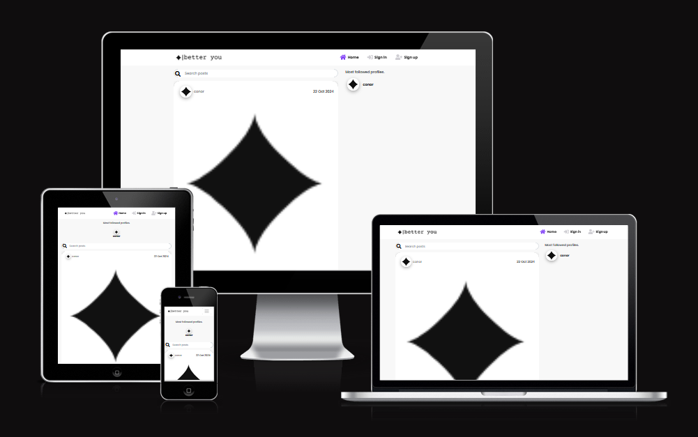

# [Better You](https://better-you-ec0aa381f182.herokuapp.com/)

This repository contains the frontend code for the Better You website. The backend Django Rest Framework API repository can be found [here](https://github.com/conor-timmis/Better-You-API). The frontend is built using React, React-Bootstrap, JavaScript, JSX, and is hosted on Heroku.

Welcome to Better You, the social platform dedicated to anybody looking to further themselves in the self-improvement space. This is a varied topic but aimed towards you and like-minded others who would like to better themselves, take on life from a whole new perspective, and gain experiences in ways they never thought possible. Better You, as a site, is a social media website, but heavily focused on self-improvement. As much as it is a broad subject, it has been simplified to stay within the relevant categories of the topic. I have built this as someone who has gone through something very similar over the last few years and experienced major changes in my life to get to this point. As a brief summary, I used to be the person who thought going outside was boring, and gaming was everything. But these days, it's the total opposite. It was definitely not an easy challenge to overcome, but I gained all kinds of new confidence and experienced many things, whether at work, at home, or outside in my free time. I cannot recommend enough that anyone take a similar path, even if the circumstances are not exactly the same, and see what is out there for yourself!

## Table of Contents

1. [Purpose](#1-purpose)
2. [Features](#2-features)
3. [Requirement Gathering and Planning](#3-requirement-gathering-and-planning)
    - [Brief Competitor Analysis and Target Demographic](#brief-competitor-analysis-and-target-demographic)
    - [User Journeys](#user-journeys)
    - [User Permissions](#user-permissions)
    - [React Components](#react-components)
    - [API Integration](#api-integration)
    - [Data Validation](#data-validation)
    - [Error Messaging](#error-messaging)

## 1. Purpose

The goal of Better You is to create a dedicated platform for individuals focused on self-improvement. It provides a space for users to share experiences, gain new perspectives, and connect with like-minded people, all while simplifying the broad topic of personal development into easily navigable categories.

Here’s a revised and more polished version of your "Features" section:

---

## 2. Features

### Existing Features

-   **Navigation Bar**: Located at the top of every page, the navigation bar provides seamless access to all parts of the site. It is fully responsive, adapting its content based on whether the user is signed in or not.

    - **Signed Out View**

    

    - **Signed In View**

    

-   **Home View**: This page is a brief overview of what you can experience without having access to everything, but with understanding of what is going on throughout the site.

    

-   **Registration Page**: A clean, minimal page featuring a simple form for users to become members of Better You.

    

-   **Feed Page**: This page conveniently displays posts from all the users you follow in one place, creating a personalized viewing experience.

    

-   **Liked Page**: Users can browse all of their previously liked posts they have made, making it easier to find posts they enjoy at another time.

    

-   **My Profile**: This serves as your personal portfolio. Your profile page will be the display for your posts, followers and following count. It will also display your personal posts in a feed so you can take a look at everything you have posted.

    

-   **Profile Editing**: Users can easily update their profile information from the Profile page, allowing you to customise your profile picture, bio, username and password at any time.

    
    

-   **Posting**: Users can create posts on the site and post within relevence to the tag they have chosen, this could be an accomplishment post, one to strike inspiration or even just a learning experience from what happened that day for them. 

    

-   **Comments/Rating/Liking**: Users can comment on a post created by another user, like their post if they found the content to be enjoyable and even leave a rating on the post to show appreciation for what the user has posted.

    

## 3. Requirement Gathering and Planning

### Brief Competitor Analysis and Target Demographic

When analysing competitors in the realm of online portfolio platforms for artists, several notable options come to mind:

-   Instagram is widely used by influencers and individuals in the self-improvement niche to share motivational content, personal growth stories, and wellness tips. However, its broad focus on various content types makes it less specialized for dedicated personal development journeys and lacks built-in tools to track progress or growth.
-   Coach.me is a platform that combines personal goal-setting with community support. It offers coaching services and goal tracking to help users develop new habits. However, its interaction is more focused on coaching and less on community-building for like-minded individuals to share their journeys.
-   Mindvalley provides personal growth courses, workshops, and events, focusing on holistic self-improvement across various domains like health, spirituality, and career. Though highly specialized in content, it is primarily a learning platform rather than a social space for user interaction and community building.

In this landscape, Better You aims to carve out a unique niche by offering a dedicated platform specifically for individuals focused on personal growth. It provides a community-driven environment where users can not only share their self-improvement journeys but also interact with like-minded individuals, gain inspiration, and offer support to one another. The goal is to foster a specialized community that encourages personal development, making Better You an ideal platform for those looking to enhance their lives in a targeted, supportive, and motivational setting.

### User Journeys

These are the core user journeys, it is not an exhaustive list of all possible user journeys, just the most important ones:

1. Sign Up and Edit User Details

2. Create a Post

3. Browse and Interact with Posts

4. Edit or Delete a Post

5. View Liked Posts

### User Permissions

Before signing up, users can explore the home page to learn more about Better You and view a sample of the content posted by users. They can also access the sign-up and login pages without needing an account.

Once signed in, users can access the full site, with restrictions ensuring they can only add, edit, or view their own personal details and posts.

The table below provides a detailed overview of page access based on authentication and authorisation:

Authentication: Requires the user to be logged in.
Authorisation: Limits access to a user's own content.
Neither: Accessible without being logged in.

| Page                                 | Access Logged Out? | Access Logged In? | Access Only Own? |
| ------------------------------------ | ------------------ | ----------------- | ---------------- |
| Home                                 | Yes                | Yes               | N/A              |
| Sign Up                              | Yes                | No                | N/A              |
| Login                                | Yes                | No                | N/A              |
| Feed                                 | No                 | Yes               | Yes              |
| Liked                                | No                 | Yes               | N/A              |
| Profile                              | No                 | Yes               | No               |
| Post Create                          | No                 | Yes               | Yes              |
| Post Edit                            | No                 | Yes               | Yes              |

Admins can access the Django admin panel for the backend API.

### React Components

This project includes several reusable React components that are used across various parts of the application. They are documented below along with their purpose and main props: 

| **Component**          | **Purpose**                                                                 | 
|------------------------|-----------------------------------------------------------------------------|
| `AppHeader`            | The main header of the application, displaying the app's title, profile name, and navigation. |
| `NavBar`               | Main navigation bar with links to various app sections, including profile and login/logout.   |
| `Avatar`               | Displays every usersAvatars and how they operate/with style throughout the site.              |
| `NotFound`             | The component that shows whenever there is nothing to be found in the resource.               |
| `StarRating`           | The system in place to post and view other users ratings on comments as well as your own.     |
| `Comment`              | Comment component is how you view yours and other users comments throughout a post.           |
| `Post`                 | Post component is how you view yours and other users posts throughout the feed.               |
| `PopularProfiles`      | Displays the top 5 popular profiles (in terms of follower count) on the side of the feed.     |

### API Integration

The HTTP requests specifications have been defined in detail, in the backend API README, [here](https://github.com/conor-timmis/Better-You-API). These formats have been used.

**Authentication Mechanism**
JSON Web Tokens (JWTs) are used for token-based authentication.

**Cross-Origin Resourcer Sharing (CORS)**
CORS is configured on the Django backend to allow requests from this React frontend. This has been done using the `django-cors-headers` package which will handle those settings.

**Data Fetching and State Management**
Axios is used for making HTTP requests to the DJango REST API backend.

React Context and Hooks are used for simple state management.

### Data Validation

Comprehensive data format specifications are available in the API repository's README. This frontend ensures that only valid data is sent to the back end by performing field-level validation before submitting any requests.

### Error Messaging

The Django REST API back end will return relevant HTTP status codes, allowing the React front end to show clear error messages to users, which helps them identify and fix problems. However, since the front end is designed to avoid situations that could cause 400, 404, or other errors, only a limited number of error messages are needed. The API error codes are documented to assist with any direct API access or use by different front ends.                                                                                       |

